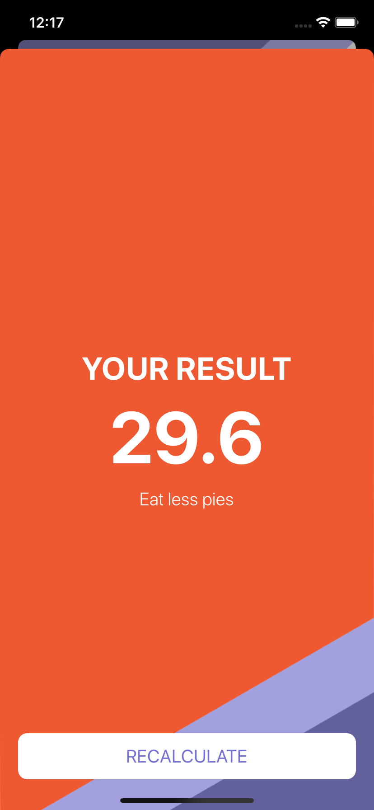

#  BMI Calculator

## Complete Xcode Application for iOS

This is BMI Calculator App, I developed while learning iOS application developement. 

## To run on your Xcode

* Swift >= 4
* Xcode >= 10
* All the required assets including app icon is added.

## App Preview

App Home Screen

Healthy BMI

Under Weight BMI 

Over Weight BMI 
